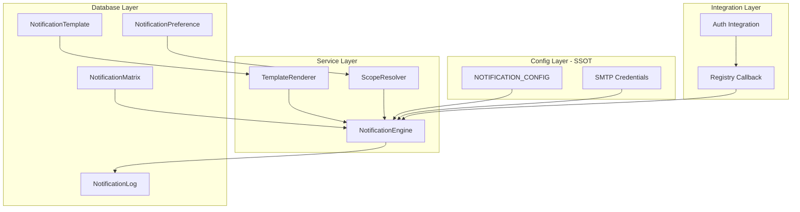
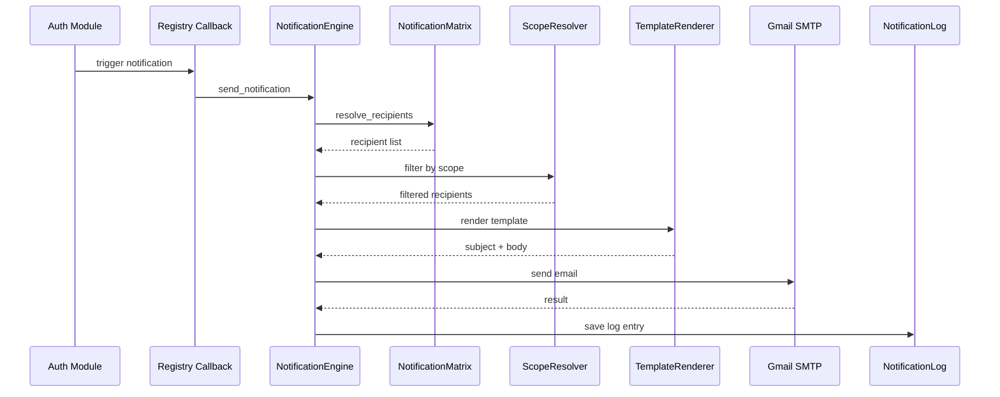

# Notification Microservice - ConfigDriven & SSOT

**Vytvorené:** 2025-12-12  
**Autor:** Michael (Sopira)  
**Status:** Planning Phase

## Overview

Vytvorenie komplexnej ConfigDriven & SSOT mikroslužby Notifications s Gmail SMTP integráciou, template systémom, komunikačnou maticou a scope-aware notifikáciami pre tri typy emailov: SA login notifikácia, nový účet (SA + user), a password reset.

---

## Architektúra Overview



---

## 1. SMTP Configuration (z Thermal Eye)

**Preniesť z Thermal Eye:**
- Gmail SMTP nastavenie (lines 337-363 v `/Users/sopira/www/thermal_eye/thermal_eye/settings.py`)
- EMAIL_HOST, EMAIL_PORT, EMAIL_USE_TLS
- EMAIL_HOST_USER, EMAIL_HOST_PASSWORD (z .env)

**Implementácia v `sopira_magic/settings.py`:**
- Pridať EMAIL_* konfiguráciu
- SSL context fix pre Mac OS
- ADMIN_EMAIL setting

---

## 2. NOTIFICATION_CONFIG - SSOT

**Vytvorenie `sopira_magic/apps/notification/config.py`:**

Podľa vzoru `authentification/config.py`:

```python
NOTIFICATION_CONFIG = {
    'smtp': {
        'backend': 'smtp',
        'enabled': True,
    },
    'notification_types': {
        'login_notification': {
            'enabled': True,
            'channel': 'email',
            'template_source': 'database',  # or 'file'
            'template_name': 'login_notification',
            'scope_aware': True,
            'default_recipients': ['admin'],
        },
        'signup_notification_admin': {
            'enabled': True,
            'channel': 'email',
            'template_source': 'database',
            'template_name': 'signup_notification_admin',
            'scope_aware': True,
            'default_recipients': ['admin'],
        },
        'signup_notification_user': {
            'enabled': True,
            'channel': 'email',
            'template_source': 'file',  # komplexnejší HTML
            'template_name': 'signup_welcome.html',
            'scope_aware': False,
            'default_recipients': ['user'],
        },
        'password_reset': {
            'enabled': True,
            'channel': 'email',
            'template_source': 'file',
            'template_name': 'password_reset.html',
            'scope_aware': False,
            'default_recipients': ['user'],
        },
    },
}
```

**Helper functions:**
- `get_notification_config(notification_type)`
- `is_notification_enabled(notification_type)`
- `get_template_config(notification_type)`

---

## 3. Database Models

**Rozšírenie `sopira_magic/apps/notification/models.py`:**

### 3.1 NotificationTemplate (existujúci - rozšíriť)
- Pridať `template_source` (database/file)
- Pridať `variables` (JSONField) - zoznam premenných pre template
- Pridať `scope_aware` flag

### 3.2 NotificationMatrix (nový)
```python
class NotificationMatrix(TimeStampedModel):
    """Communication matrix - kto dostane aké notifikácie"""
    notification_type = CharField  # login_notification, signup_notification_admin, etc.
    recipient_type = CharField  # admin, user, custom, scope_admins
    recipient_identifier = CharField  # email alebo user ID alebo scope pattern
    enabled = BooleanField
    scope_pattern = CharField  # blank=True, pre scope-aware notifications
    conditions = JSONField  # dodatočné podmienky
```

### 3.3 NotificationLog (nový)
```python
class NotificationLog(TimeStampedModel):
    """Audit log pre odoslané notifikácie"""
    notification_type = CharField
    recipient_email = CharField
    status = CharField  # sent, failed, pending
    error_message = TextField
    template_used = CharField
    context_data = JSONField  # data použité pri renderingu
    scope = ForeignKey (nullable)
```

---

## 4. NotificationEngine - Core Service

**Vytvorenie `sopira_magic/apps/notification/engine.py`:**

Podľa vzoru `authentification/engine.py`:

```python
class NotificationEngine:
    @classmethod
    def send_notification(cls, notification_type: str, context: Dict) -> Dict:
        """Hlavná metóda pre odoslanie notifikácie"""
        # 1. Check config - is enabled?
        # 2. Resolve recipients (matrix + scope)
        # 3. Render template
        # 4. Send email via SMTP
        # 5. Log result
    
    @classmethod
    def resolve_recipients(cls, notification_type: str, context: Dict) -> List[str]:
        """Resolve recipients z matrix + scope"""
    
    @classmethod
    def render_template(cls, notification_type: str, context: Dict) -> Tuple[str, str]:
        """Render subject & body"""
```

---

## 5. Template System (Hybrid)

**Vytvorenie `sopira_magic/apps/notification/template_renderer.py`:**

- **Database templates:** Pre jednoduché textové notifikácie (login_notification, signup_admin)
- **File templates:** Pre komplexné HTML emaily (signup_welcome, password_reset)

```python
class TemplateRenderer:
    @classmethod
    def render(cls, template_source: str, template_name: str, context: Dict) -> Tuple[str, str]:
        """Render template based on source type"""
        if template_source == 'database':
            return cls._render_database_template(template_name, context)
        elif template_source == 'file':
            return cls._render_file_template(template_name, context)
```

**Vytvorenie template súborov v `sopira_magic/templates/notifications/`:**
- `signup_welcome.html`
- `password_reset.html`

---

## 6. Scope Integration

**Vytvorenie `sopira_magic/apps/notification/scope_resolver.py`:**

Integrácia so `scoping`:

```python
class ScopeResolver:
    @classmethod
    def get_scope_admins(cls, user) -> List[str]:
        """Get admin emails in user's scope"""
    
    @classmethod
    def filter_by_scope(cls, recipients: List, user, scope_pattern: str) -> List[str]:
        """Filter recipients based on scope"""
```

---

## 7. Integration s Authentification

**Registrácia callback v `sopira_magic/apps/notification/apps.py`:**

```python
class NotificationConfig(AppConfig):
    def ready(self):
        from .integration import register_with_auth
        register_with_auth()
```

**Vytvorenie `sopira_magic/apps/notification/integration.py`:**

```python
def notification_handler(notification_type: str, data: Dict):
    """Handler pre authentification notifications"""
    from .engine import NotificationEngine
    NotificationEngine.send_notification(notification_type, data)

def register_with_auth():
    from sopira_magic.apps.authentification.integration.notification import register_notification_integration
    register_notification_integration(notification_handler)
```

---

## 8. Email Templates Content

### 8.1 Login Notification (Database)
**Typ:** Plain text/HTML v DB  
**Recipient:** Admin (scope-aware)  
**Variables:** username, ip_address, user_agent, timestamp

### 8.2 Signup Notification Admin (Database)
**Typ:** Plain text v DB  
**Recipient:** Admin (scope-aware)  
**Variables:** username, email, role, timestamp

### 8.3 Signup Welcome User (File)
**Typ:** Pekný HTML súbor  
**Recipient:** Nový user  
**Variables:** first_name, username, login_url

### 8.4 Password Reset (File)
**Typ:** HTML súbor  
**Recipient:** User  
**Variables:** username, reset_url, token_expiry

---

## 9. Management Commands

**Vytvorenie `sopira_magic/apps/notification/management/commands/`:**

- `init_notification_templates.py` - Inicializácia templates z config
- `test_notification.py` - Test odoslania emailu
- `init_notification_matrix.py` - Inicializácia communication matrix z config

---

## 10. Admin Interface

**Rozšírenie `sopira_magic/apps/notification/admin.py`:**
- NotificationMatrixAdmin
- NotificationLogAdmin (read-only)
- Akcie: "Test Send", "Preview Template"

---

## Implementation Flow



---

## Kľúčové Princípy

1. **ConfigDriven:** Všetko vychádza z NOTIFICATION_CONFIG (SSOT)
2. **Žiadny HardCode:** Všetky notification types, recipients, templates sú konfigurovateľné
3. **Scope-Aware:** Integrácia so scoping modulom pre hierarchické permissions
4. **Hybrid Templates:** Database pre simple, Files pre complex HTML
5. **Audit Trail:** Každá notifikácia sa loguje do NotificationLog
6. **Registry Pattern:** Loose coupling cez callback registration (ako v auth)

---

## Database Migrations

1. Rozšírenie NotificationTemplate
2. Vytvorenie NotificationMatrix
3. Vytvorenie NotificationLog
4. Run init commands pre templates a matrix

---

## Testing Strategy

1. Unit testy pre NotificationEngine
2. Template rendering testy
3. Scope resolution testy
4. Integration test s Auth module
5. Manual test: `python manage.py test_notification login_notification`

---

## Implementation Checklist

- [ ] Preniesť Gmail SMTP nastavenie z Thermal Eye do sopira_magic/settings.py
- [ ] Vytvoriť NOTIFICATION_CONFIG v notification/config.py (SSOT)
- [ ] Rozšíriť NotificationTemplate a pridať NotificationMatrix a NotificationLog modely
- [ ] Vytvoriť NotificationEngine core service (send, resolve, log)
- [ ] Vytvoriť TemplateRenderer pre hybrid template system
- [ ] Vytvoriť ScopeResolver pre scope-aware recipient resolution
- [ ] Vytvoriť HTML template súbory pre signup_welcome a password_reset
- [ ] Vytvoriť database template content pre login a signup_admin notifications
- [ ] Vytvoriť integration.py a zaregistrovať callback s Auth modulom
- [ ] Vytvoriť management commands (init_templates, init_matrix, test_notification)
- [ ] Rozšíriť admin.py pre NotificationMatrix a NotificationLog
- [ ] Vytvoriť a aplikovať migrations, spustiť init commands
- [ ] Otestovať všetky tri typy notifikácií (login, signup, password reset)

---

**Poznámky:**
- Všetky credentials (EMAIL_HOST_USER, EMAIL_HOST_PASSWORD) budú v .env.local
- ADMIN_EMAIL bude konfigurovateľný v settings.py
- Scope integration bude použiteľná aj pre iné moduly v budúcnosti
- Template system je extensible - ľahko pridať SMS, push notifications neskôr

